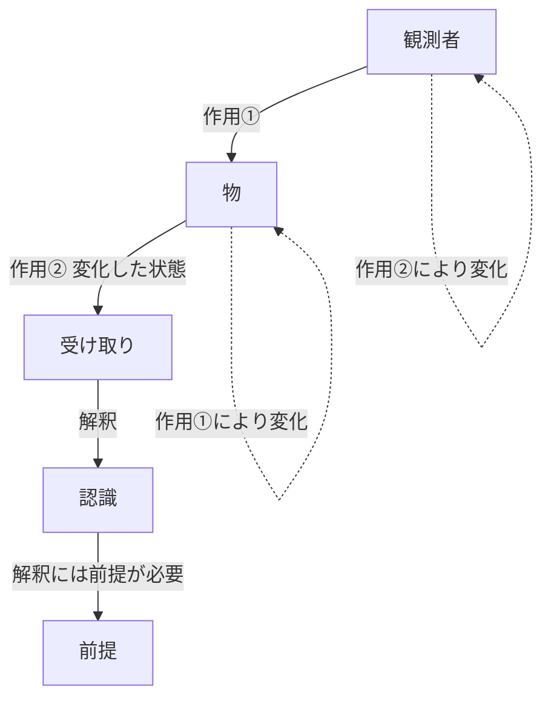
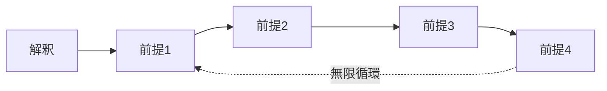
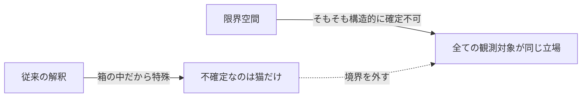
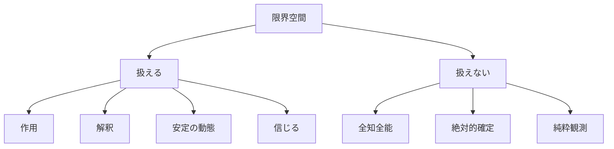
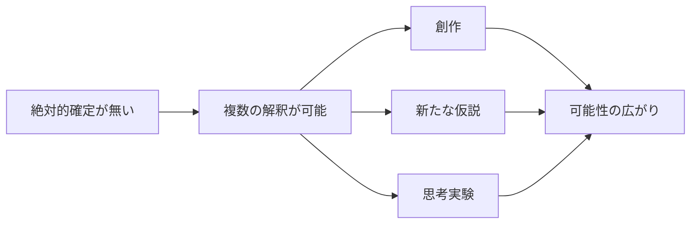

## はじめに

「目の前のリンゴは、本当にそこにあると言い切れるか？」

哲学っぽい問いに見えるが、これは「気分の問題」ではなく**構造の問題**として扱える。
この記事では、その扱い方の出発点となる **限界空間** という思考の枠組みを紹介する。

### この記事で扱うこと

- 限界空間とは何か
- なぜ「物」を純粋に観測できないのか
- なぜ「限界」なのに自由が広がるのか
- シュレーディンガーの猫を限界空間で読み直す

### この記事で扱わないこと

- 限界空間の上で動く応用層（RDFやSILNなどの言語化）は別記事で扱う
- 厳密な物理学・量子論の解釈論争には踏み込まない

---

## 結論（先に要点）

:::message
**限界空間とは、絶対的な前提を置かずに思考するための空間である。**

- 「物」を直接観測することは構造仕様上できない
- 確定という概念は局所的にしか成立しない
- しかしその限界こそが、可能性の広がりを担保している
:::

「不確かさ」を欠点ではなく**土壌**として扱うのが、この空間の基本姿勢である。

---

## 観測の構造的限界

### 私たちは「物」ではなく「作用」を見ている

何かを観測するとき、観測者の手元に届くのは「物」そのものではない。
**「物」から来る作用**だけである。

*図1：素朴な観測モデル*

ここまでなら問題はない。だが、この素朴モデルには三つの穴がある。

1. 作用を送る時点で「物」は影響を受けて変化する
2. 受け取った作用は、解釈しないと「認識」にならない
3. 観測者自体も作用によって変化する

これらを足すと、図はこう書き直される。

*図2：作用と変化の循環を含めたモデル*

観測した瞬間に対象は変わる。
解釈した瞬間に観測者も変わる。
**「物」と「観測者」は固定された二者ではなく、相互に変化し続ける関係**になる。

### 前提は無限循環する

図2の右下、「解釈には前提が必要」という部分をさらに掘ると、もっと厄介な構造が出てくる。

解釈の前提Aには、それを保証する前提Bが必要になる。
前提Bには、それを保証する前提Cが必要になる。
そして前提Cには……。

*図3：前提の無限循環*

「絶対的なもの」が絶対だと**保証するもの自体**が、また保証を必要とする。
これは循環し、終わらない。

:::message
つまり「純粋に物を見る」という行為は、構造仕様の段階で成立しない可能性がある。
ここで「可能性」と曖昧に書くのは、この考え方自体もこの考え方の対象に含まれるためである。「絶対こうだ」と言えば、その瞬間に矛盾する。
:::

---

## 確定が成立しない空間

この限界性を出発点に据えると、よく知られた思考実験の見え方が変わる。

### シュレーディンガーの猫を拡張する

ランダムで猫が死ぬ箱の話。
箱を開けるまで猫の状態は確率でしか記述できない、というやつだ。

通常はこう読まれる。

| 対象 | 状態 |
| ---- | ---- |
| 箱の中の猫 | 観測前は不確定 |
| 目の前のリンゴ | 確定している |

限界空間ではこうなる。

| 対象 | 状態 |
| ---- | ---- |
| 箱の中の猫 | 確定できない |
| 目の前のリンゴ | 確定できない |
| あらゆる観測対象 | 確定できない |

*図4：解釈の拡張*

「箱の中だから分からない」のではない。
**そもそもこの空間では『確定』という概念が成立しない**のだ。

この読み方では、量子実験で起きていることは「不思議な現象」ではなくなる。
当たり前のことが、当たり前に起きているだけ、と読み替えられる。
ただ、それが分かりやすい形で示されただけ。

---

## 限界空間で扱えないもの

この空間にも、再現できない性質が一つある。

それが **全知全能** である。

*図5：扱えるもの／扱えないもの*

全方位に確定性を持つ性質は、限界空間の前提と真正面から矛盾する。
これは「物語」の中でさえ整合的に扱えない。
こういう性質のものは、形而上空間に分離して置くことになる。

:::message alert
ただし、限界空間でも「**信じる**」ことは可能である。
語りえぬものも、信じることはできる。
扱えないことと、関わりが持てないことは別である。
:::

---

## なぜ「限界」なのに「自由」なのか

ここまで読むと、こう感じるかもしれない。

> 結局、私たちは限界という檻に閉じ込められて、何も分からない悲しい生き物なのか？

そうではない。むしろ逆である。

**限界性こそが、可能性の広がりを担保している。**

*図6：限界が可能性を生む流れ*

シュレーディンガーの猫がそうだ。
箱の中身が分からない**からこそ**、様々な解釈が生まれた。
その解釈たちは創作や新たな仮説の土壌となり、限界空間という考え方自体にも流れ込んでいる。

「限界」という名前に、実は偽りがある。
**実際の可能性は、限界の中で広がり続ける。**

---

## 軽い応用例

限界空間の枠で物を眺めると、既存の理論への接続が自然に見えてくることがある。

:::details 例：物理現象との接続（仮説的読み替え）
- 確定が成立しないなら、事象の地平線の解釈も変わる。ホーキング放射が起きる理由と自然につながる読みが可能になる。
- あらゆる可能性が試される空間だからこそ、「生命」のような自己組織的な何かが生まれる土壌になったのではないか。

これらは厳密な証明ではなく、空間ルールに沿った言葉遊びである。
ただし、この遊びの中から新しい仮説や応用が立ち上がる可能性は十分にある。
:::

:::message
**なぜ「遊び」と呼ぶのか？**

限界空間は、答えを与える空間ではなく、思考を試す空間である。
最低限のルールの中で、何を見つけ、何を予測し、何を発見するかは読み手次第になる。
だから「遊び」という言葉が一番近い。
:::

---

## まとめ

限界空間が提供するのは、答えそのものではない。**思考のための空間**である。

最低限のルールはこれだけ。

- 絶対的前提を置かない
- 純粋観測は構造的に不可能
- 確定は局所的にしか成立しない
- 全知全能は形而上に分離する
- それでも「信じる」ことは可能

ここから先、この空間でどう遊ぶかは自由である。

> 人生はカオスの海を、安定を手掛かりに航行する旅である。
>
> 限界空間は、その航行を言葉遊びとして試すための、思考の空間である。

---

## 次回予告

限界空間は前提だけを定めた空間なので、自由度が高すぎて足掛かりが欲しくなる。
そこで登場するのが、安定の動態を「作用の関係性」から記述する応用層 **RDF（関係力学言語）** である。
これは別記事で扱う。
