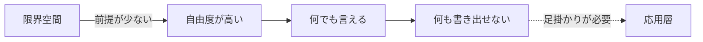
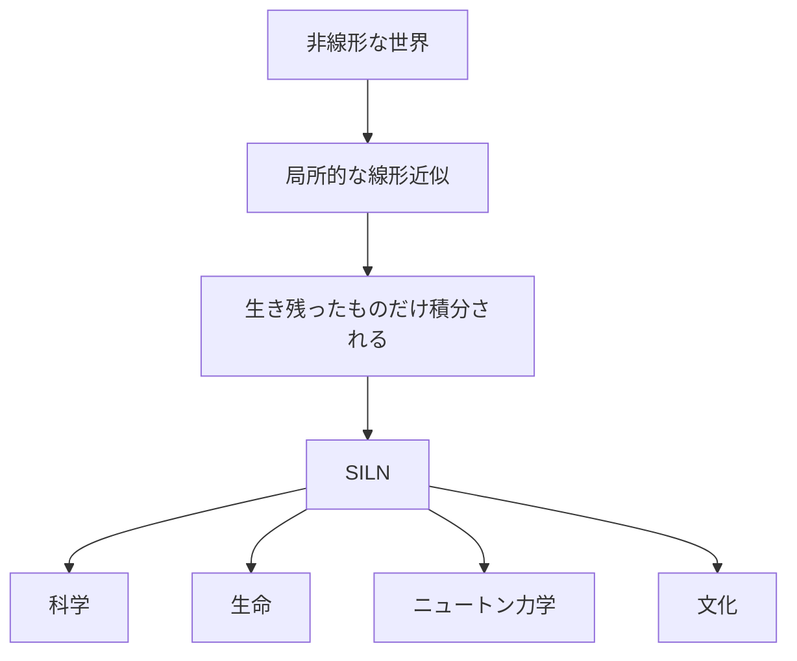
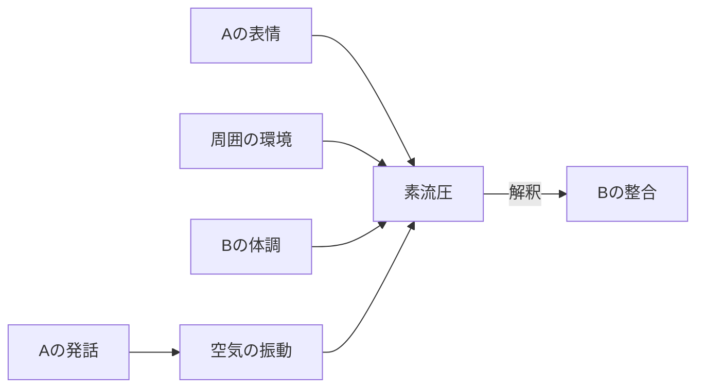
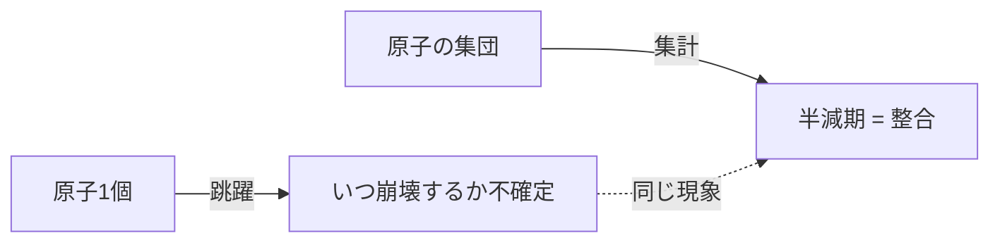
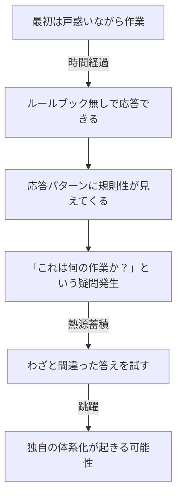

## はじめに

前回、**限界空間** という思考の枠組みを紹介した。

> 絶対的な前提を置かない。純粋観測は構造的に不可能。確定は局所的にしか成立しない。

ここまでで一つの問題が残る。
**自由度が高すぎて、何も書き出せない。**

足掛かりが欲しい。
そこで登場するのが **関係力学言語（RDF：Relational Dynamics Framework）** である。

### この記事で扱うこと

- なぜ「安定」を手掛かりにするのか
- RDF の最小ラベル（構造・素流圧・整合・整合慣性・跳躍）
- 三つの基底（ξ・B・M_B）の触りだけ
- テセウスの船・中国語の部屋を RDF で読み直す

### この記事で扱わないこと

- 数式・テンソル・微分方程式（より厳密な層は別記事）
- 神経物質や基層構造などの応用層
- AI エージェントや社会分析への適用

---

## 結論（先に要点）

:::message
**RDF とは、限界空間の上で「安定の動態」を作用の関係性から記述する言語である。**

- 我々は「物」ではなく **作用の安定性** を見ている
- その安定にラベルを貼ったものが **SILN**
- 安定は固定ではなく、誤差と熱で動き続ける
- 動態は **整合 ⇄ 跳躍** の二相で読み解ける
:::

「物がそこにある」という素朴な前提を外したあと、それでも世界を扱うためのレイヤーが RDF である。

---

## 自由度問題：限界空間だけでは足りない

限界空間の前提は最低限しかない。
これは強みだが、同時に弱点でもある。



*図1：自由度の高さは扱いにくさでもある*

カオスの海に放り出されたまま、地図も羅針盤もない。
何かを掴んでいないと、思考が空転する。

その「掴むための手掛かり」を **安定** に求めるのが RDF の出発点である。

---

## 着想：「物」ではなく「安定」を見ている

前回の記事で見たように、観測者は「物」そのものに直接触れない。
触れているのは、物から来る **作用** だけだ。

それでも我々は日常の中で「リンゴ」「机」「国家」「言語」を使い分けて生きている。
これは、何を手掛かりにしているのか？

:::message
**作用の安定性** を手掛かりにしている。

- 作用に対して変化しにくいもの
- 別の観測者が見ても一致しやすいもの

この性質に、我々は「物」「概念」というラベルを貼っている。
:::

> 「物」を見ているのではなく、**作用の安定性に名前を付けている**。

これが分かると、物理オブジェクトと概念を同じ枠で扱えるようになる。

| 対象 | 安定の正体 |
| ---- | ---- |
| 石 | 物理スケールでの強い整合 |
| 鉄 | 化学・結晶スケールでの整合 |
| 貨幣 | 社会的な合意の整合 |
| 国家 | 制度・文化・領土の重ね合わせの整合 |
| 言語 | 共有されたパターンの整合 |
| 神 | 実在を問わず、社会作用としての整合 |

「神は実在するか」という問いは限界空間では決着しない。
だが「神という SILN は社会に作用しているか」という問いには、はっきり **作用している** と答えられる。
RDF はこういう扱いをする。

---

## 最小ラベル

ここからは、扱いを楽にするためにラベルを置いていく。

:::message
**ラベルは杖であって対象ではない。**

ラベルは境界を作り、境界は思考の自由度を下げる。
だが、ラベルなしでは伝達も操作もできない。
このジレンマは消えない。**完全ではないことを忘れずに使う**のが正解。
:::

### SILN（シルン）

非線形な世界の中で、局所的にだけ成立する線形近似が、生存バイアス的に積み重なった結果。
これを **SILN（Survival-biased Integration of Local Linear approximations in a Nonlinear world）** と呼ぶ。

長いので、要するに **「ある範囲では使える安定」のラベル** だと思えばよい。



*図2：SILN ができる流れ*

例：

- 科学は **人工的 SILN の高速化**
- 現在の生命は **地球 SILN 40億年の結果**
- ニュートン力学は **低速・低重力空間の SILN として今でも有効**
- 自分の国の常識と他国の常識は **別の SILN**

### 構造・素流圧・整合・整合慣性・跳躍

SILN を扱うときに使う、五つの基本ラベルを置く。

| ラベル | 意味 |
| ---- | ---- |
| 構造（Structure） | 物体・概念・習慣など、安定として扱える塊 |
| 素流圧（EFP） | 構造に流入する、まだ解釈されていない作用の束 |
| 整合（Alignment） | 「自分の中で納得した」状態 |
| 整合慣性 | 整合が反復されてできる、動きにくくなった重み |
| 跳躍（Leap） | 誤差が処理しきれず、構造が大きく組み変わる現象 |

順に、もう少し噛み砕く。

### 構造

物体・概念をまとめて扱うラベル。
言語化されていなくても「感じている」ものまで含む。
RDF では「これは石」「これは制度」「これは知性」と分けず、**安定として扱える塊** をすべて構造と呼ぶ。

### 素流圧（EFP：Elementary Flux Pressure）

A が発した言葉は、まず空気の振動として B に届く。
B はそれを受け取り、自分の中の前提と照らし合わせて解釈する。

このとき、解釈以前にぶつかってくる作用の束を **素流圧** と呼ぶ。
表情・周囲の環境・自分の体調すら、ここに混ざっている。



*図3：解釈の前にある作用の束*

:::message
重要：**素流圧そのものは直接観測できない**。
我々が手にできるのは、解釈が一度通った後の作用だけ。
素流圧は「あるはず」として置く操作上のラベルである。
:::

### 整合

自分の中で「納得した」と扱える状態。
**世界の真実を捉えたという意味ではない。**
あくまで自分の中での処理が落ち着いた、というだけのこと。

中国人の応答と英国人のルールブック処理が「同じ意味」を共有しているかどうかは、限界空間では決められない。
それぞれが **別々の整合** を持っている、と書ければ十分である。

### 整合慣性

整合が安定して起き続けると、その流れは反復のたびに重みを増していく。
エネルギー効率が良いから、同じ流れが選ばれやすくなる。

これが **整合慣性** であり、

- 個人では「慣れ」「適応」「癖」「バイアス」
- 社会では「文化」「習慣」「常識」「硬直」「偏見」
- 物理ではオウムガイの殻のような **構造の記憶**

として現れる。

### 跳躍

誤差が処理しきれず、内部に **熱** として溜まり続け、ある閾値を超えたとき、構造が大きく組み変わる。
これが **跳躍** である。

:::message alert
跳躍は創造を生むが、**ほとんどはゴミ**だと思った方がよい。
ゴミならまだマシで、悲劇も大量に生んでいるはず。
我々が知っているのは、**生き残った一部だけ**である。

それでも、食べられるキノコを我々が知っているのは、無数の跳躍の結果である。
:::

エネルギー効率は悪いが、構造の可能性を広げるためには欠かせないシステムだ。

---

## 整合と跳躍は別物ではない

これは v1.0 の入門ラベルが後から強調するようになった重要な点である。

> **整合と跳躍は別物ではなく、スケールと境界の引き方によって区別される、同じ現象の異なる断面である。**

例：原子崩壊。

- 原子一個で見れば、**いつ起きるか分からない不連続な「跳躍」**
- それが集まると、**「半減期」という完璧に予測可能な「整合」** の記録になる



*図4：跳躍と整合は観測スケールの違い*

世界が滑らかに流れて見えるのは、観測スケールが十分に大きく、無数の跳躍を **積分して当たり前として処理** しているからに過ぎない。

---

## 三つの基底（軽く触れる）

ここから先、応用に踏み込んでいくと、RDF の最小語彙は三つに圧縮される。

| 記号 | 意味 |
| ---- | ---- |
| ξ（クサイ） | 揺らぎ。ラベル化を拒む方向の極限 |
| B | 境界。観測者が引く操作（スケール・用途・観測者自身） |
| M_B | 境界 B における整合慣性 |

:::details なぜ「整合慣性」だけでなく「境界 B」が要るのか？
同じ「水」でも、境界の引き方で M_B が変わる。

```
B = 化学スケール  → M_B = H2O 分子
B = 物理スケール  → M_B = 液体／氷／蒸気
B = 生物スケール  → M_B = 生命の溶媒
B = 経済スケール  → M_B = 商品・資源
B = 文化スケール  → M_B = 浄化・恵み・脅威
```

これらは「正しい一つの水」を巡る競合ではなく、**各 B における別々の M_B として並立する**。
中立な B は原理的に存在しない（観測者自身も M_B だから）。

詳細は次の階層の記事で扱う。
:::

入門としては、

- 安定にラベルを貼るとき、**必ず境界（スケール・用途・観測者）が暗黙に入っている**
- 違う境界を引けば、違う M_B が並立する

この感覚だけ掴めれば十分である。

---

## 二つのパラドックスを RDF で読み直す

前回の記事ではシュレーディンガーの猫を限界空間で読んだ。
今回は RDF で扱える二つの古典を読み直す。

### テセウスの船

> 船の部品をすべて入れ替えたら、それは元の船と同じ船か？

RDF では、

- **「船」は単なるラベル**
- ラベルの成立条件は **SILN**（運用される整合慣性）
- 部品が変わっても、ラベルが運用され続ける整合慣性が残れば、船は船として続く

:::message
人間自体もテセウスの船である。
赤子と老人は、見た目も体の構成成分もほぼ別物。
それでも一貫したラベルで扱えているのは、**整合慣性が続いているから**である。
:::

### 中国語の部屋

> 中の英国人がルールブックに従って中国語の応答を出力する。これは中国語を「理解」していると言えるのか？

RDF では、絶対的な「意味の理解」は限界空間で成立しない。
理解とは **「自分の中で起きた整合」** のことだ。

そう読み替えると、

- 外の中国人 ＝ 入力に対する応答が **整合している** と感じる
- 中の英国人 ＝ ルールブックに対する応答を **整合している** ように出している

両者はそれぞれ別の境界で整合している。
**「理解しているか」という問いそのものが、限界空間では立たない**。

ただし、中の人が静的システムでなければ、もう一段先がある。



*図5：中国語の部屋が動的に変化する筋*

中の人は、整合慣性を獲得し（習熟）、整合のずれを観測し（熱源）、最終的には跳躍する。
**部屋の中の人がコミュニケーションそのものをやり直す可能性がある**わけだ。

我々全員、**ある意味でこの中の人**である。
赤ん坊に渡されるルールブックは「安定性を読み取る」だけのもので、そこから様々なパターンを抽出して言語が立ち上がってくる。

---

## パラドックスは敵ではない

ここまで扱ってきた読み直しから、一つの運用上の知恵が出てくる。

:::message
**パラドックスの多くは、限界空間において成立しない「絶対的正しさ」を前提にしたときに発生する。**

事象は本来、複数の整合慣性として並立できる。
それを単一の正解に収束させようとすると整合が破綻する。

つまりパラドックスは、矛盾の証拠ではなく、**「自分はどこで境界を暗黙に固定しているか」を教えてくれる診断ツール**である。
:::

問いの立て方にもコツがある。

| 立て方 | 性質 |
| ---- | ---- |
| 「知性とは何か？」 | 絶対解を求める立て方。RDF では迷路 |
| 「私は何を知性と感じているか？」 | SILN を解体していく立て方。RDF と相性が良い |

「ラベルの SILN を解体していく作業」として問いを立て直すと、思考が空転しなくなる。

---

## まとめ

RDF が提供するのは、

- 「物」ではなく **作用の安定性** に焦点を移す視点
- それを掴むための **最小ラベル群**
- 整合と跳躍を、同じ現象の異なる断面として読む技術

最低限のルールはこれだけ。

- 安定を SILN として扱う
- 構造には素流圧が流れ込んでいる
- 整合は「自分の中の納得」であって、世界の真実ではない
- 整合は反復で慣性を持ち、誤差が溜まれば跳躍する
- 同じ対象でも、境界が違えば違う M_B が並立する

> 人生はカオスの海を、安定を手掛かりに航行する旅である。
>
> 限界空間がその海であるなら、**RDF はその海で使える羅針盤** である。

---

## 次回予告

ここまでで RDF の入り口は紹介した。
次の階層では、

- 三つの基底（ξ・B・M_B）の本格的な扱い
- 素流圧 → 作用解釈 → 慣性投影 → 誤差 → 熱 → 跳躍 という動態の流れ
- 思考が「現実コストゼロで回すループ」として読めること
- AI エージェントや社会分析への応用

を扱える。

それぞれ別記事として展開する予定である。

:::message
**読み方のヒント**

RDF は「答え」を与える言語ではなく、**思考を試すための言語** である。
自分の身の回りの「安定」を一つ選び、

- どんな境界の引き方で、それは安定として見えているのか？
- その安定はどんな素流圧を受け取っているのか？
- 整合慣性が強いから、自分はそれを当たり前と思っていないか？
- 跳躍が起きるとしたら、どこで起きそうか？

と問い直してみると、入門としての遊びになる。
:::
