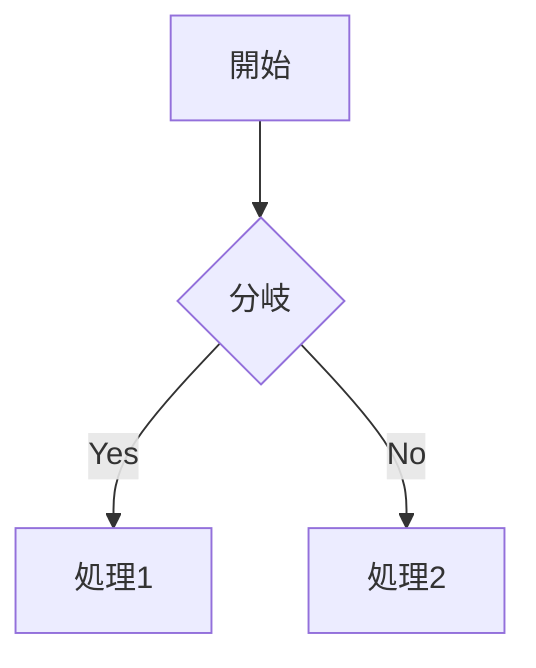

# Zenn Markdown 記述ガイド

## 目的

このドキュメントは、Zennで記事を書くときに使うMarkdown記法を、実際の執筆時に参照しやすい形で整理した記述ガイドである。

Zenn公式のMarkdown記法一覧をもとに、基本記法・Zenn独自記法・埋め込み・注意点・記事テンプレートをまとめる。

---

## 1. 基本文書構造

### 見出し

Zenn記事の本文では、見出しは `##` から始める運用が扱いやすい。

```md
## 大見出し

### 中見出し

#### 小見出し
```

### 運用目安

- `#` は記事タイトル相当として扱い、本文ではなるべく使わない
- 本文の大区分は `##`
- その中の説明区分は `###`
- 細かい補足は `####`
- 見出し階層を飛ばさない

---

## 2. リスト

### 箇条書き

```md
- 項目A
- 項目B
  - 子項目B-1
  - 子項目B-2
```

`-` または `*` が使えるが、記事内ではどちらかに統一すると読みやすい。

### 番号付きリスト

```md
1. 最初の手順
2. 次の手順
3. 最後の手順
```

### 運用目安

- 手順は番号付きリスト
- 並列項目は箇条書き
- 階層が深くなりすぎる場合は、見出しに分ける

---

## 3. リンク

### テキストリンク

```md
[表示テキスト](https://example.com)
```

### URLカード

URLだけを1行で置くと、カード型リンクとして表示される。

```md
https://zenn.dev/zenn/articles/markdown-guide
```

明示的にカード化したい場合は、次の形式を使う。

```md
@[card](https://example.com)
```

### URL認識が崩れる場合

アンダースコア `_` を含むURLなどで自動認識が崩れる場合がある。

```md
<https://example.com/__sample__>
```

またはカード記法を使う。

```md
@[card](https://example.com/__sample__)
```

---

## 4. 画像

### 基本

```md

```

### Altテキスト

```md

```

### 横幅指定

URLの後ろに半角スペースを入れて `=幅x` を付ける。

```md

```

### キャプション

画像の直下に、イタリック記法でキャプションを書く。

```md

*図1：処理の流れ*
```

### 画像にリンクを貼る

```md
[](https://example.com)
```

### 運用目安

- 画像にはできるだけAltテキストを付ける
- 図表にはキャプションを付ける
- 大きすぎる画像は横幅指定で調整する

---

## 5. テーブル

```md
| 項目 | 内容 | 備考 |
| ---- | ---- | ---- |
| A | 説明A | 補足A |
| B | 説明B | 補足B |
```

### 運用目安

- 比較・対応表・一覧に使う
- 長文を詰め込みすぎない
- スマホ表示を考え、列数は少なめにする

---

## 6. コードブロック

### 基本

````md
```js
const hello = () => {
  console.log("Hello Zenn")
}
```
````

### ファイル名付きコードブロック

言語名の後ろに `:ファイル名` を付ける。

````md
```js:example.js
const hello = () => {
  console.log("Hello Zenn")
}
```
````

### diff表示

````md
```diff js
- const value = 1
+ const value = 2
```
````

### diff + ファイル名

````md
```diff js:example.js
- const value = 1
+ const value = 2
```
````

### 運用目安

- コードには可能な限り言語名を指定する
- 複数ファイルを扱うときはファイル名を付ける
- 変更点を示すときは `diff` を使う
- diffでは行頭の `+` / `-` / 半角スペースを意識する

---

## 7. 数式

ZennではKaTeXによる数式表示が使える。

### ブロック数式

```md
$$
e^{i\theta} = \cos\theta + i\sin\theta
$$
```

### インライン数式

```md
$a \ne 0$
```

### 運用目安

- ブロック数式の前後には空行を入れる
- 文中の短い数式はインラインにする
- 長い式や説明対象の式はブロックにする

---

## 8. 引用・脚注・区切り線

### 引用

```md
> 引用文
> 引用文の続き
```

### 脚注

```md
本文中の脚注例です[^1]。
インライン脚注も書けます^[脚注の内容]。

[^1]: 脚注の内容
```

### 区切り線

```md
---
```

### 運用目安

- 引用は他者の文章や仕様文の参照に使う
- 補足が長くなりすぎるときは脚注へ逃がす
- 区切り線は章の大きな切れ目に限定する

---

## 9. インライン装飾

```md
*イタリック*
**太字**
~~打ち消し線~~
`inline code`
```

### コメント

公開ページに表示しない自分用メモはHTMLコメントで書ける。

```md
<!-- TODO: あとで追記する -->
```

注意：複数行コメントには対応していない。

### 運用目安

- 強調は使いすぎない
- コマンド名、変数名、短いコード片はインラインコードにする
- TODOは公開前に確認する

---

## 10. Zenn独自記法

### メッセージ

```md
:::message
補足メッセージを書く
:::
```

### 警告メッセージ

```md
:::message alert
注意・警告を書く
:::
```

### アコーディオン

```md
:::details タイトル
折りたたみたい内容を書く
:::
```

### ネスト

外側の要素は `:` を増やす。

```md
::::details タイトル
:::message
中に入れるメッセージ
:::
::::
```

### 運用目安

- 補足情報は `:::message`
- 危険・破壊的操作・非推奨事項は `:::message alert`
- 長い補足や詳細ログは `:::details`
- ネストは便利だが、深くしすぎない

---

## 11. 外部コンテンツの埋め込み

### X / Twitter

ポストURLを単独行で置く。

```md
https://x.com/example/status/1234567890
```

アンダースコアを含むURLで崩れる場合は、明示記法を使う。

```md
@[tweet](https://x.com/example/status/1234567890)
```

リプライ元を非表示にしたい場合は、URLに `?conversation=none` を付ける。

```md
https://x.com/example/status/1234567890?conversation=none
```

### YouTube

```md
https://www.youtube.com/watch?v=xxxxxxxxxxx
```

### GitHubファイル

```md
https://github.com/user/repo/blob/main/README.md
```

行指定もできる。

```md
https://github.com/user/repo/blob/main/README.md#L1-L10
```

### GitHub Gist

```md
@[gist](https://gist.github.com/user/id)
```

特定ファイルのみ表示したい場合：

```md
@[gist](https://gist.github.com/user/id?file=example.json)
```

### CodePen

```md
@[codepen](https://codepen.io/user/pen/id)
```

### SpeakerDeck

```md
@[speakerdeck](スライドID)
@[speakerdeck](スライドID?slide=24)
```

### Docswell

```md
@[docswell](https://www.docswell.com/s/user/slide-id)
```

### Figma

```md
@[figma](Figmaの共有URL)
```

### 運用目安

- 埋め込みURLは前後に空行を入れる
- GitHubはテキストファイルの埋め込みに使う
- 動画・スライド・外部デモは記事の流れを止めない位置に置く

---

## 12. Mermaidダイアグラム

Zennでは `mermaid` を指定したコードブロックで図を表示できる。

````md

````

### 制限事項

- クリックイベントは無効
- 1ブロックあたり2000文字以内
- フローチャートの `&` によるChain数は10以下
- Mermaid側の変更により表示が変わる可能性がある

### 運用目安

- 複雑すぎる図は画像化も検討する
- 1つの図に詰め込みすぎない
- 図の前後に説明文を置く

---

## 13. 入力補完

ZennのMarkdownエディタでは、絵文字の入力補完が使える。

```md
:任意の文字
```

---

## 14. Zenn記事の基本テンプレート

```md
## はじめに

この記事で扱うこと、扱わないことを書く。

## 前提

読者に必要な知識、環境、バージョンを書く。

## 結論

先に要点を書く。

## 本文

### 背景

なぜこの話が必要かを書く。

### 手順または考察

具体的な内容を書く。

### 注意点

詰まりやすい点、破壊条件、非推奨事項を書く。

## まとめ

この記事で得られる判断・再利用可能な知見を書く。
```

---

## 15. 公開前チェックリスト

### 構造

- [ ] 見出し階層が飛んでいない
- [ ] 本文の大見出しは `##` から始めている
- [ ] 章ごとの役割が明確
- [ ] まとめがある

### 可読性

- [ ] 長すぎる段落を分割した
- [ ] 箇条書きと表を適切に使った
- [ ] コード・画像・表の前後に説明がある
- [ ] 強調を使いすぎていない

### 技術記事としての確認

- [ ] コードブロックに言語名がある
- [ ] 必要な箇所にファイル名がある
- [ ] diffは行頭記号が正しい
- [ ] バージョンや前提条件を書いた

### Zenn固有の確認

- [ ] 補足は `:::message` を使った
- [ ] 警告は `:::message alert` を使った
- [ ] 長い補足は `:::details` にした
- [ ] Mermaidが制限内に収まっている
- [ ] 埋め込みURLは単独行にした

### アクセシビリティ

- [ ] 画像にAltテキストを入れた
- [ ] 図にキャプションを付けた
- [ ] 見出し構造が読み上げ順として自然
- [ ] リンクテキストが「こちら」だけになっていない

---

## 16. 使い分け早見表

| やりたいこと | 記法 |
| ---- | ---- |
| 大見出し | `## 見出し` |
| 箇条書き | `- 項目` |
| 番号付き手順 | `1. 手順` |
| リンク | `[text](URL)` |
| URLカード | URL単独行 または `@[card](URL)` |
| 画像 | `` |
| 画像幅指定 | `` |
| コード | ```言語名 |
| ファイル名付きコード | ```言語名:ファイル名 |
| diff | ```diff 言語名 |
| 数式ブロック | `$$ ... $$` |
| インライン数式 | `$...$` |
| 引用 | `> 引用` |
| 脚注 | `[^1]` と `[^1]: 内容` |
| 補足メッセージ | `:::message` |
| 警告 | `:::message alert` |
| 折りたたみ | `:::details タイトル` |
| Mermaid | ```mermaid |

---

## 17. 執筆方針

Zenn記事では、記法そのものよりも「読者が迷わない構造」が重要である。

推奨する流れは次の通り。

1. 先に結論を書く
2. 前提条件を書く
3. 手順・考察を小さな見出しに分ける
4. コード・図表の前後に説明を置く
5. 注意点をZenn独自記法で目立たせる
6. 最後に再利用可能な形でまとめる

---

## 18. 最小ルール

迷ったら、次だけ守る。

```md
## 見出し

短い説明文を書く。

- 要点1
- 要点2
- 要点3

```js:example.js
console.log("example")
```

:::message alert
注意点を書く。
:::
```

これだけでも、Zenn記事として最低限読みやすい構造になる。

